# Digital Identity & Reputation Platform for Gig Workers

A secure, normalized, portable, and production-grade database architecture designed to solve the fragmentation of work history, earnings, ratings, skills, and professional reputation across multiple gig platforms (e.g., Uber, Swiggy, Zomato, Urban Company, Upwork, Shadowfax).

---

## 📌 Problem Statement Addressed

Gig workers operate across multiple discrete platforms, resulting in:
1. **Fragmented Work History & Ratings**: 1,000 rides on Uber, 500 deliveries on Swiggy, and 300 tasks on Urban Company exist in isolated silos with zero interoperability.
2. **Financial Invisibility**: Banks, NBFCs, and credit card issuers struggle to evaluate creditworthiness due to lack of standard payslips, even if a worker maintains steady aggregate monthly earnings.
3. **Reputational Lock-In**: A worker cannot port hard-earned 5-star ratings or customer trust when moving to a new platform or seeking traditional employment.
4. **Privacy & Exploitation Risks**: Workers have no fine-grained control over which external entities can see their personal, financial, or performance records.
5. **Unfair Retaliation & Arbitrary Suspensions**: Single disputed ratings can permanently derail worker livelihood without fair dispute mediation or anomaly protection.

This platform introduces a **worker-centric digital identity model** that aggregates verified multi-platform metrics into a portable profile with **granular consent management**, **W3C verifiable credentials**, **dispute mediation**, and **portable reputation badges**.

---

## 🗂 Database & Platform Components

| Component / File | Type | Description |
| :--- | :--- | :--- |
| `migrations/` | Directory | Sequenced forward (`UP`) and rollback (`DOWN`) migration scripts (`001` through `004`). |
| `migrate.py` | CLI Tool | Migration lifecycle runner: `up`, `down`, `status`, `reset`, `create <name>`. |
| `schema.sql` | SQL (PostgreSQL 14+) | Enterprise PostgreSQL schema featuring custom ENUMs, triggers for automatic reputation scoring, and analytical views. |
| `schema_sqlite.sql` | SQL (SQLite / ANSI) | Portable, zero-dependency schema for local development or edge deployments. |
| `seed_data.sql` | SQL Dataset | Seed dataset modeling gig workers across delivery, rideshare, home services, and tech freelancing with badges, disputes, and webhooks. |
| `gig_identity.db` | SQLite Database | Pre-compiled, ready-to-query SQLite binary database. |
| `dal.py` | Python 3.12 Module | Data Access Layer providing methods for consent validation, audit logging, profile queries, and dispute management. |
| `backup_restore.py` | Python Utility | Online atomic database backup, restore, and foreign key / low-level integrity verification. |
| `database_setup.py` | Python Script | Automated runner executing migrations, data seeding, integrity checks, and analytical reports. |

---

## 🏗 Entity Relationship & Domain Architecture

```mermaid
erDiagram
    WORKERS ||--o{ IDENTITY_DOCUMENTS : "verifies with"
    WORKERS ||--o{ PLATFORM_ACCOUNTS : "links"
    PLATFORM_ACCOUNTS ||--o{ WORK_ENGAGEMENTS : "logs"
    PLATFORM_ACCOUNTS ||--o{ EARNINGS_RECORDS : "records"
    PLATFORM_ACCOUNTS ||--o{ PLATFORM_RATINGS : "tracks"
    WORKERS ||--o{ EARNINGS_MONTHLY_SUMMARIES : "summarizes"
    WORKERS ||--o{ WORKER_SKILLS : "possesses"
    SKILLS ||--o{ WORKER_SKILLS : "categorizes"
    WORKERS ||--o{ CERTIFICATIONS : "holds"
    WORKERS ||--o{ REPUTATION_SCORES : "aggregates"
    WORKERS ||--o{ CLIENT_REVIEWS : "receives"
    WORKERS ||--o{ VERIFIABLE_CREDENTIALS : "owns"
    ORGANIZATIONS ||--o{ CONSENT_GRANTS : "requests"
    WORKERS ||--o{ CONSENT_GRANTS : "authorizes"
    CONSENT_GRANTS ||--o{ ACCESS_AUDIT_LOGS : "governs"
    WORKERS ||--o{ WORKER_BADGES : "earns"
    REPUTATION_BADGES ||--o{ WORKER_BADGES : "defines"
    WORKERS ||--o{ DISPUTES : "files"
    WORKERS ||--o{ FRAUD_RISK_ALERTS : "monitors"
    ORGANIZATIONS ||--o{ API_KEYS : "authenticates"
    ORGANIZATIONS ||--o{ WEBHOOK_SUBSCRIPTIONS : "listens"
```



---

## ⚡ Database Migrations System

The platform includes a built-in, zero-dependency migration manager (`migrate.py`) tracking versions via `schema_migrations` with execution time and SHA-256 checksums:

```bash
# Check current migration status
python migrate.py status

# Run all pending forward migrations
python migrate.py up

# Roll back the last applied migration
python migrate.py down

# Reset and rebuild database from scratch
python migrate.py reset

# Create a new migration file template
python migrate.py create add_tax_records
```

### Migration History

* **`001_initial_core_schema.sql`**: Core tables (`workers`, `identity_documents`, `platforms`, `platform_accounts`, `work_engagements`, `earnings_records`, `earnings_monthly_summaries`, `skills`, `worker_skills`, `certifications`, `platform_ratings`, `reputation_scores`, `client_reviews`, `verifiable_credentials`, `organizations`, `consent_grants`, `access_audit_logs`).
* **`002_analytics_and_views.sql`**: Views for unified 360 profiles (`vw_worker_unified_profile`), financial health underwriting (`vw_worker_financial_health`), cross-platform breakdown, and active consent compliance.
* **`003_fraud_disputes_badges.sql`**: Anomaly detection (`fraud_risk_alerts`), dispute arbitration (`disputes`), and portable badges (`reputation_badges`, `worker_badges`).
* **`004_webhooks_and_api_keys.sql`**: External API key authentication (`api_keys`), webhook subscriptions (`webhook_subscriptions`), and delivery logs (`webhook_events`).

---

## 🛡 Advanced Enterprise Database Components

### 1. Dispute Mediation & Reputation Freezing (`disputes`)
Prevents catastrophic drops in reputation score during client or platform conflicts:
- When a dispute is filed, `reputation_impact_frozen` is set to `1`.
- If resolved in worker favor, retaliatory ratings are automatically scrubbed from composite scoring calculations.

### 2. Fraud & Manipulation Detection (`fraud_risk_alerts`)
Detects telemetry anomalies, review padding, abnormal trip velocity, and simultaneous contradictory active gigs.

### 3. Portable Reputation Badges (`reputation_badges`, `worker_badges`)
Workers carry verified achievements across all platforms:
- `Top 1% Delivery Velocity`
- `Zero Cancellation Champion`
- `1000+ Completed Gigs Veteran`
- `Master Appliance Specialist`
- `Top Rated Tech Consultant`

### 4. Real-Time Webhooks & Verifier API Keys
- Banks and prospective employers authenticate with hashed, rate-limited `api_keys`.
- Webhook subscriptions notify external systems on `consent.revoked`, `rating.updated`, and `credential.issued`.

---

## 🛠 Operations & Data Access Layer (DAL)

### Python Data Access Layer (`dal.py`)
```python
from dal import GigIdentityDAL

dal = GigIdentityDAL()

# 1. Fetch 360 unified worker profile
profile = dal.get_unified_profile("did:gig:worker:in-blr-78901")
print(profile["full_name"], profile["reputation_score"], profile["reputation_tier"])

# 2. Enforce consent check before disclosing data to a bank
auth = dal.verify_and_log_access(
    access_token="mock_token",
    organization_id="org-hdfc-001",
    endpoint="/api/v1/verifications/financial-profile",
    requested_attributes=["monthly_net_earnings", "income_stability_index"]
)

# 3. Retrieve financial underwriting summary
fin = dal.get_financial_underwriting_summary(profile["worker_id"])
print(f"Avg Monthly Net: INR {fin['avg_monthly_net_income']}, Stability: {fin['avg_stability_index']}")
```

### Database Backup & Integrity Check (`backup_restore.py`)
```bash
# Create an online atomic backup
python backup_restore.py backup

# Verify database foreign keys and low-level pages
python backup_restore.py check

# List available backups
python backup_restore.py list

# Restore from a backup file
python backup_restore.py restore gig_identity_backup_20260903_194527.db
```
